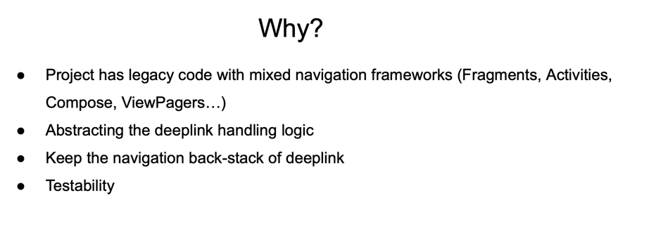
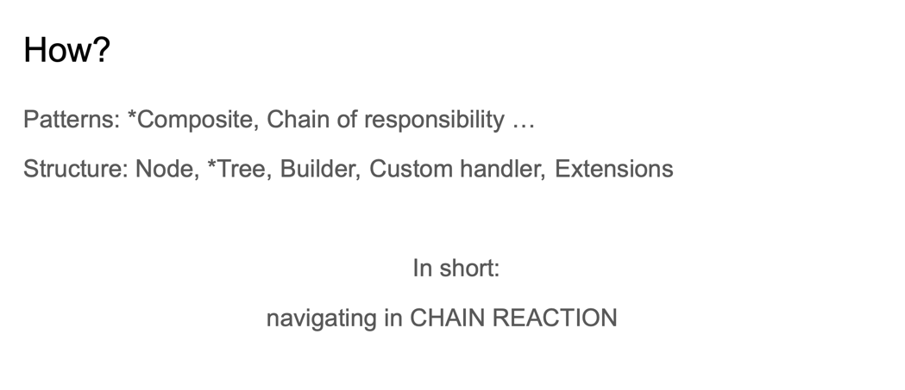
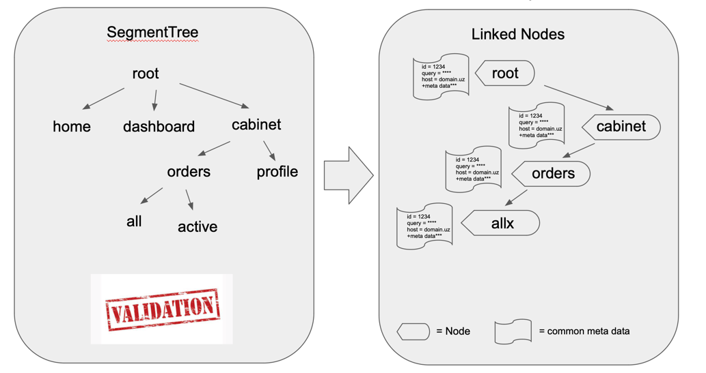

DeeLinker 
The (*Dee) tool for handling deeplinks in a project where navigation logic is mixed all over different frameworks and components.
DeeLinker separates navigation logic from deeplinks and generates chained nodes for you to consume (*navigate).

E.g. Non single activity project with fragments or a project which is migrating or has a plan to migrate to Jetpack Compose gradually.








Setup Gradle:

```
allprojects {
repositories {
maven { url 'https://jitpack.io' }
}
}
```
```implementation 'com.github.jakhongirmadaminov:deelinker:[release-version]'```
